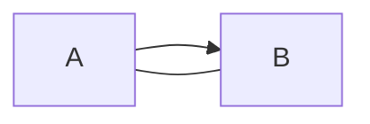
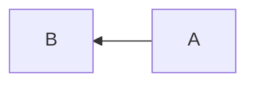
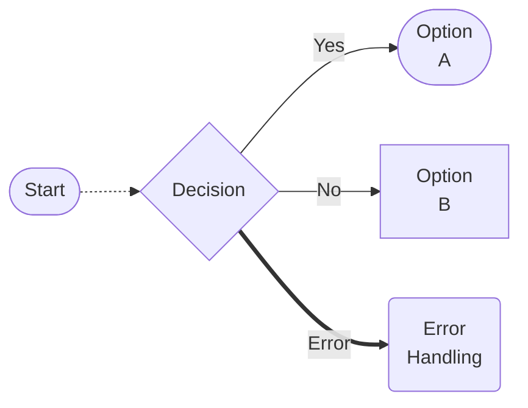

# Markdown Tips and tricks

## Markdown styling resources

- https://www.markdownguide.org/cheat-sheet/
- https://github.com/adam-p/markdown-here/wiki/markdown-cheatsheet
- https://jojozhuang.github.io/tutorial/mermaid-cheat-sheet/

## Code Comments
*See source code of this document for examples of code commenting in markdown*
<!-- This is a comment  -->
[comment]: # (This is also a comment)

## Mermaid

Diagram As Code

<!-- Using the ``` ``` operators -->

<!-- can also use ::: ::: operators -->
:::mermaid
graph LR;    
:::

<!-- LR = Left to Right -->
<!-- RL = Right to Left -->
<!-- BT = Bottom to Top -->
<!-- TB = Top to Bottom -->




<!-- Basic Flow chart -->
